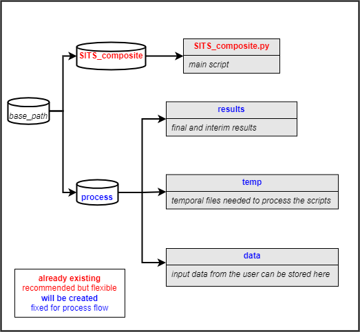

# SITS bands composite

SITS bands composite allows you to download high quality Level 1C - 2A data from Sentinel 2A, 2B and Landsat LT04, LT05, LE07, LC08; 
from your area of Interest (aoi) including the associated DEM. 
The code uses Satellite Image Time Series (SITS) composite based on [FORCE Time Series framework](https://force-eo.readthedocs.io/en/latest/index.html).

## 1. Installing

The basic parameters installations are implemented for Ubuntu 22.04 "jammy":


```
conda create --name SITScomp python==3.9
conda activate SITScomp
cd /path/to/repository/SITS_composite
pip install -r requirements.txt
sudo snap install aws-cli --classic
gdalinfo --version #Check if you have it already in your system, if not run:
sudo apt install gdal-bin
```
Notes:
code is build upon FORCE-Datacube and -Framework (Docker, recommended FORCE-Version 3.7.11)

* [How to install FORCE with Docker](https://force-eo.readthedocs.io/en/latest/setup/docker.html#docker).

## 2. Getting Started

### Previous setup before running the script.

Currently, Landsat data can be downloaded without a login, but downloading Sentinel-2 data requires authentication. 
This is done through gcloud, and it only needs to be done once before the first run. Running gcloud will create a 
.boto file,normally in your home user directory (you will need to define it's location within the main script).
You can follow the instructions on 
[the gcloud services](https://cloud.google.com/sdk/docs/install) website. Check the [Level-1C FORCE setup](https://force-eo.readthedocs.io/en/latest/howto/level1-csd.html) for more information.


### Basics

The script is based on the following folder structure:



**To use the scripts:**

You will need to create a directory for the project and use it as a _base_path_. 
Specify your parameters within the main script and execute them. 
The first function creates the folder structure of the project and you can store your aoi in it.
To create the L2A data is recommendable to check the parameter file in advance. The type of data downloaded is:
* L1C data:
Level 1 data are radiometrically calibrated and georectified.

* L2A data:
Level 2 data most notably include some sort of atmospheric correction and probably other corrections like topographic 
correction.

For more information about the L2A data, parameters and more check the official [FORCE L1A](https://force-eo.readthedocs.io/en/latest/howto/l2-ard.html) website.

## Authors

* [Sebastian Valencia](https://github.com/Azarozo19)

## License

This project is licensed under the GNU General Public Licence, Version 3 (GPLv3) - see the LICENSE.md file for details

