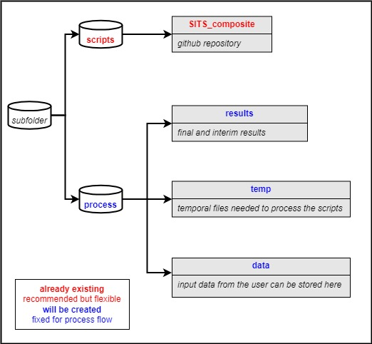

# SITS bands composite

Code for Satellite Image Time Series (SITS) composite based on [FORCE Tme Series framework](https://force-eo.readthedocs.io/en/latest/index.html)

## 1. Installing

Refer to the repository [SITS Classification](https://github.com/LUP-LuftbildUmweltPlanung/SITS_classification) for parameters installations 

```
conda create --name SITScomp python==3.9
conda activate SITScomp
cd /path/to/repository/SITS_composite
pip install -r requirements.txt
```
Notes: 
The repository is build upon FORCE-Datacube and - Framework (Docker, recommended FORCE-Version 3.7.11)
[How to install FORCE with Docker](https://force-eo.readthedocs.io/en/latest/setup/docker.html#docker)

The code is build upon CUDA 11.4

_Can also work with other versions but be careful with other libraries or changed functionalities_

## 2. Getting Started

### Previous setup before running the script

Currently, Landsat data can be downloaded without a login, but downloading Sentinel-2  
data requires authentication. This is done through gsutil and gcloud only needs to be done once before the first run. 
The credentials will be stored in a file called .boto in the user’s home directory[Level-1C FORCE setup](https://force-eo.readthedocs.io/en/latest/howto/level1-csd.html)
Get the HMAC key from [the gcloud services](https://console.cloud.google.com/storage/settings) > Interoperability, 
create your key and use it as a credential. 

### Basics

The script is based on the following folder structure:



**To use the scripts:**

Specify parameters within the main scripts and execute them. The Script should be straightforward. 
The parameter file is recommendable to check if before running.

* L1C data
Level 1 data are radiometrically calibrated and georectified.

* L2A data
Level 2 data most notably include some sort of atmospheric correction and probably other corrections like topographic 
correction.

For more information about the L2A data, parameters and more check the official [FORCE L1A](https://force-eo.readthedocs.io/en/latest/howto/l2-ard.html) website.

## Authors

* [Sebastian Valencia](https://github.com/Azarozo19)

## License

This project is licensed under the GNU General Public Licence, Version 3 (GPLv3) - see the LICENSE.md file for details

